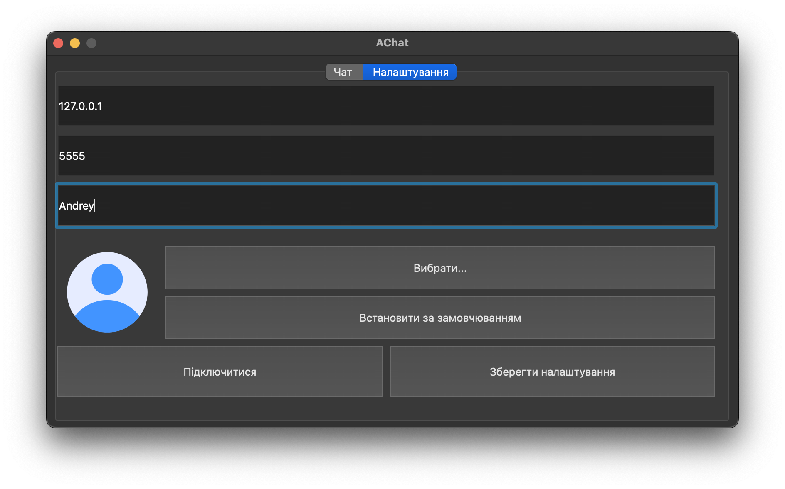
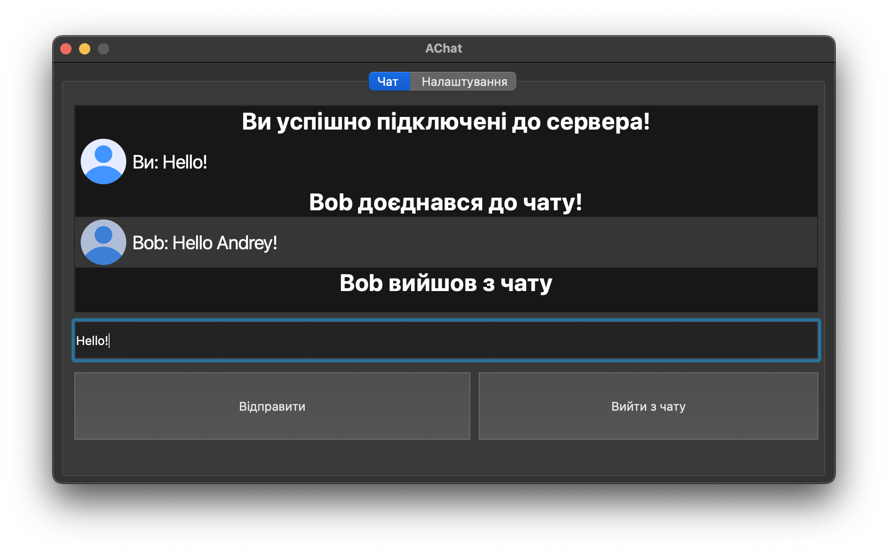

# AChat-2.0
Вдосконалена версія чату на Python PyQt6

# Встановлення
1. Встановлюємо Python 3.12.0
2. Встановлюємо pip
3. Встановлюємо Git
4. Пишемо у термінал git clone https://github.com/Andboogl/AChat-2
5. Пишемо у термінал наступне:
```
cd AChat-2
pip install -r requirements.txt
cd client
python3 main.py
```
6. Відкриваємо нове вікно терміналу та пишемо наступне:
```
cd <шлях_до_репозиторія>/server
python3 server.py
```
7. Вводимо IP та порт сервера
8. Підключаємось по IP та порту у чаті
9. Користуємося

# Нʼюанси роботи
- Программа не працює на Windows, тому-що деякі функції можливі тільки на macOS та Linux

- Всі налаштування зберігаються по шляху /Users/<імʼя вашого користувача>/.achat

- Программа логує себе, і всі логи зберігаються по шляху /Users/<імʼя вашого користувача>/.achat/logs

# Демонстрація ПЗ


